# 🧠 NeuroTutor

**NeuroTutor** is a Flask-based web application designed to help users enhance their debugging skills and understand Python code better through interactive challenges. The platform includes user authentication, code analysis, and automatic correction capabilities.

---

## 🚀 Features

- 🧾 **User Authentication** (Register/Login/Logout)
- 🛠️ **Code Debugging Challenges**
- 🧪 **Code Error Detection**
- 🔧 **Automatic Code Correction**
- 📊 **Progress Tracking** (questions debugged & codes corrected)

---

## 🖥️ Tech Stack

- **Backend:** Python, Flask  
- **Frontend:** HTML, Jinja2 Templates  
- **Database:** MySQL (via `flask_mysqldb`)  
- **Security:** Password hashing with Werkzeug  
- **Debugging Engine:** Custom modules (`groq_api_debug`, `symbolic_debugger`)

---

## 📂 Project Structure

```
.
├── app.py                   # Main Flask app
├── templates/               # HTML templates
│   ├── index.html
│   ├── login.html
│   ├── register.html
│   ├── my_badges.html
│   ├── code.html
│   └── debug.html
├── static/                  # All the CSS and JS codes
│   ├── images/              # Contains all the images of Badges
│   ├── bg.svg
│   ├── style.css
│   └── script.js
├── groq_api_debug.py        # Challenge code generator & comparison logic
├── symbolic_debugger.py     # Code analysis and correction
├── groq_api.py              # Correct code generator based on Errors
├── LICENSE
├── README.md
```

---

## 🛠️ Setup Instructions
### 1. Clone the Repository
```
git clone https://github.com/Skanda-P-R/NeuroTutor.git
cd NeuroTutor
```
### 2. Install Dependencies
```
pip install -r requirements.txt
```
### 3. Set Environment Variables
First head to [Groq Console](https://console.groq.com/home), create an account, and get an ```API Key```.<br>
Next we will set up the environment variables.
For **Linux** users, type this in your terminal:
```
export sql_username=your_mysql_username
export sql_password=your_mysql_password
export groq_api=your_groq_api
```
For **Windows** users, follow the below steps:<br>
1. Press "Windows + R" buttons. This will open the ```Run``` application.
2. Type ```sysdm.cpl``` and click OK.
3. Select ```Advanced``` Tab and click on ```Environment Variables```.
4. In the ```User Variables``` tab, click on ```New```, and set the "Variable Name" as ```sql_username``` and "Variable Value" as ```your_mysql_username```.
5. Create two more variables for ```sql_password``` and ```groq_api```.
### 4. Configure MySQL
Login to your MySQL server, and execute these queries.
```
CREATE DATABASE neuro_tutor_db;

USE neuro_tutor_db;

CREATE TABLE users (
    id INT AUTO_INCREMENT PRIMARY KEY,
    email VARCHAR(255) NOT NULL UNIQUE,
    password VARCHAR(255) NOT NULL,
    questions_debugged INT DEFAULT 0,
    codes_corrected INT DEFAULT 0,
    coins INT DEFAULT 0,
    last_coin_award DATETIME DEFAULT NULL
);

CREATE TABLE badges (
    id INT AUTO_INCREMENT PRIMARY KEY,
    name VARCHAR(100) NOT NULL,
    description TEXT DEFAULT NULL,
    icon_filename VARCHAR(255) DEFAULT NULL
);

CREATE TABLE user_badges (
    id INT AUTO_INCREMENT PRIMARY KEY,
    user_id INT NOT NULL,
    badge_id INT NOT NULL,
    awarded_on TIMESTAMP DEFAULT CURRENT_TIMESTAMP,
    FOREIGN KEY (user_id) REFERENCES users(id) ON DELETE CASCADE,
    FOREIGN KEY (badge_id) REFERENCES badges(id) ON DELETE CASCADE,
    UNIQUE(user_id, badge_id)  -- Ensures a user cannot be awarded the same badge multiple times
);

INSERT INTO badges (id, name, description, icon_filename) VALUES
(1, 'Code Fixer I', 'Corrected 5 code submissions', 'code_fixer_1_icon.png'),
(2, 'Code Fixer II', 'Corrected 10 code submissions', 'code_fixer_2_icon.png'),
(3, 'Syntax Surgeon', 'Corrected 25 code submissions', 'syntax_surgeon.png'),
(4, 'First Login', 'Awarded for the first login', 'first_login_icon.png'),
(5, 'Coin Collector I', 'Awarded after collecting 5 coins', 'coin_collector_1_icon.png'),
(6, 'Coin Collector II', 'Awarded after collecting 10 coins', 'coin_collector_2_icon.png'),
(7, 'Coin Collector III', 'Awarded after collecting 25 coins', 'coin_collector_3_icon.png'),
(8, 'First Debug', 'Debugged your first question', 'debug_first_icon.png'),
(9, 'Debug Mastery I', 'Debugged 5 questions', 'debug_mastery_1_icon.png'),
(10, 'Debug Mastery II', 'Debugged 10 questions', 'debug_mastery_2_icon.png'),
(11, 'Bug Slayer', 'Debugged 25 questions', 'bug_slayer_icon.png');
```
### 5. Run the App
```
python app.py
```
Visit http://localhost:5000/ in your browser.

---

## ✅ API Endpoints

| Route                  | Method    | Description                          |
|------------------------|-----------|--------------------------------------|
| `/`                    | GET       | Home page (protected)                |
| `/login`               | GET/POST  | User login                           |
| `/register`            | GET/POST  | User registration                    |
| `/logout`              | GET       | Logout and clear session             |
| `/code-checker`        | GET       | Code checker interface               |
| `/debugger-challenge`  | GET       | Debugging challenge interface        |
| `/get_code`            | POST      | Get code based on difficulty         |
| `/check_solution`      | POST      | Submit and verify debugging solution |
| `/check_errors`        | POST      | Analyze code for errors              |
| `/correct_code`        | POST      | Get AI-corrected version of the code |
| `/my-badges`           | POST      | Get the list of earned badges of user|

--- 

## 🙌 Contribution
Feel free to fork this repo and submit pull requests. For major changes, open an issue first to discuss your idea.

---

## 📃 License
This project is licensed under the MIT License. See the [LICENSE](https://github.com/Skanda-P-R/NeuroTutor/blob/main/LICENSE) file for details.

---

## 🖼️ Badge Gallery

<p align="center">
  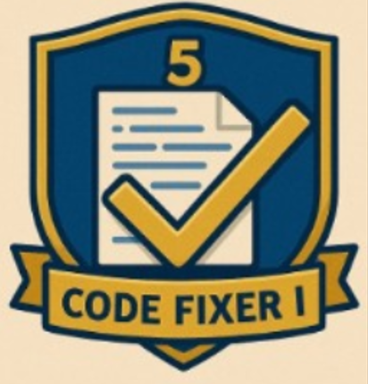
  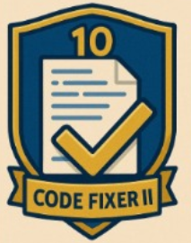
  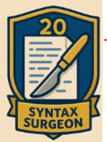
  
  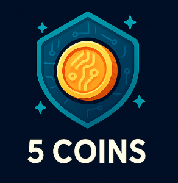
  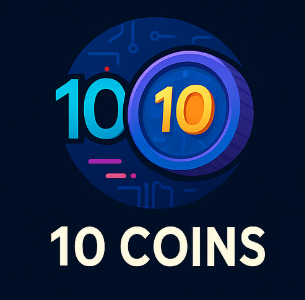
  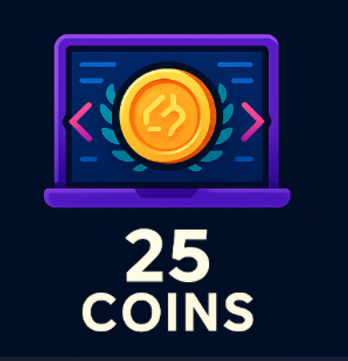
  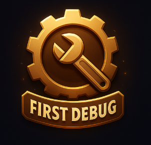
  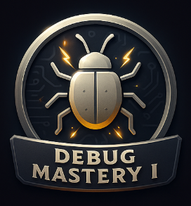
  
  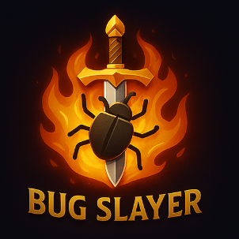
</p>

---
## 🌐 Website Preview

<details>
<summary>🔐 Login Page</summary>
<p align="center"></p>
</details>

<details>
<summary>📝 Register Page</summary>
<p align="center"></p>
</details>

<details>
<summary>🧰 Tool Selection</summary>
<p align="center">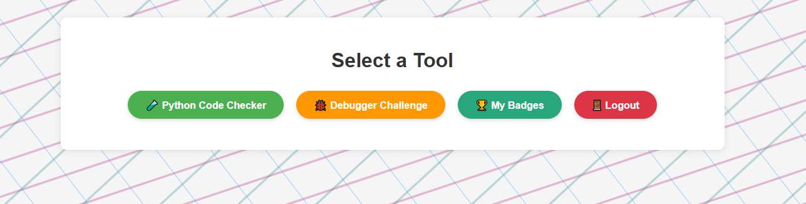</p>
</details>

<details>
<summary>🧠 Code Error Checking and Correcting</summary>
<p align="center">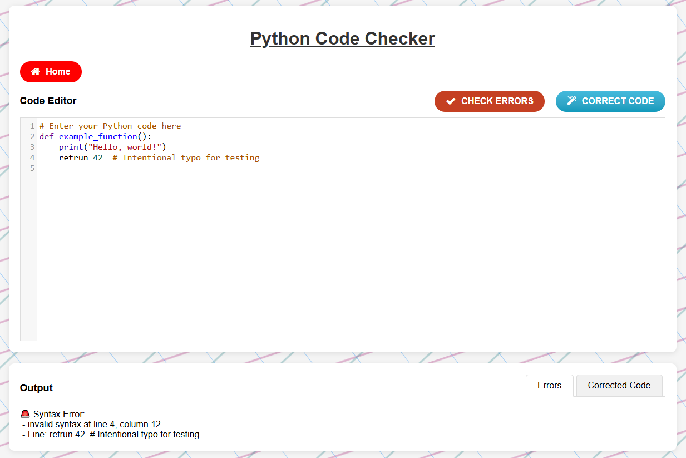</p>
</details>

<details>
<summary>🐞 Code Debugging</summary>
<p align="center">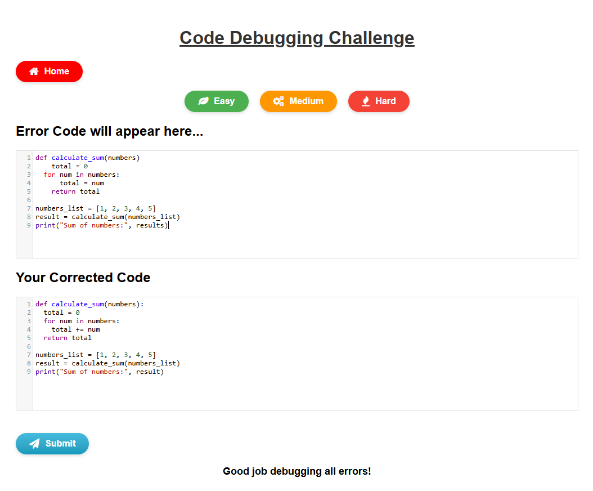</p>
</details>

<details>
<summary>🏅 Badge Popup</summary>
<p align="center">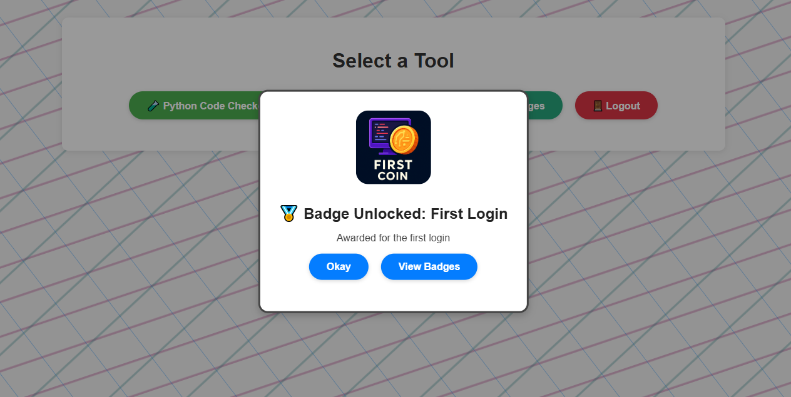</p>
</details>

<details>
<summary>🎖️ Viewing the Earned Badges</summary>
<p align="center">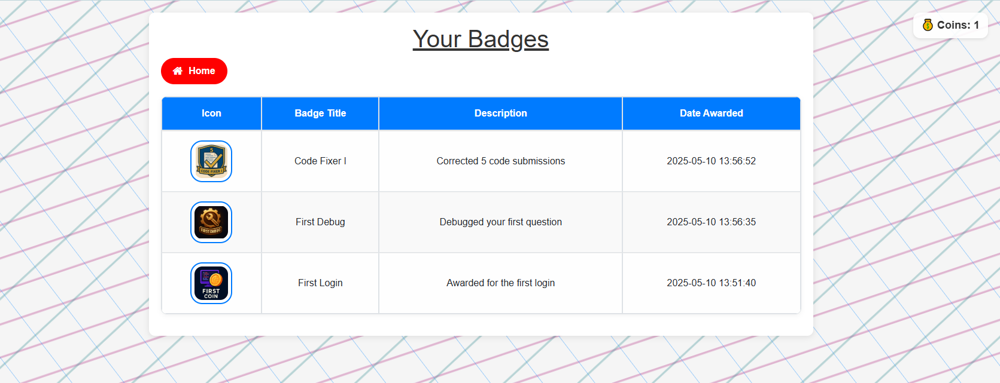</p>
</details>

<details>
<summary>📜 Badges Description</summary>
<p align="center">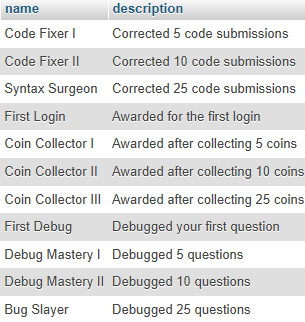</p>
</details>
