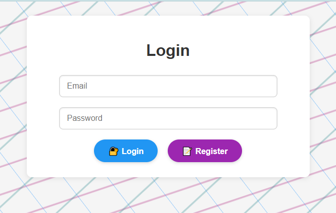
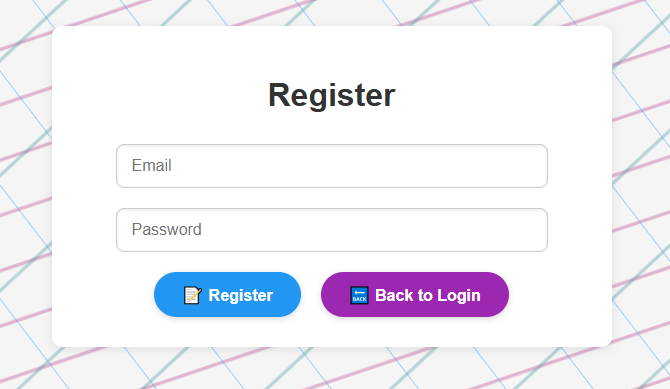
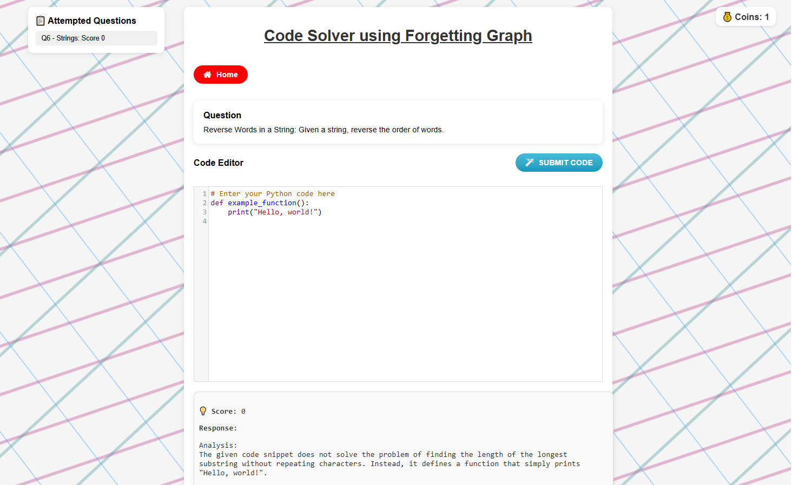
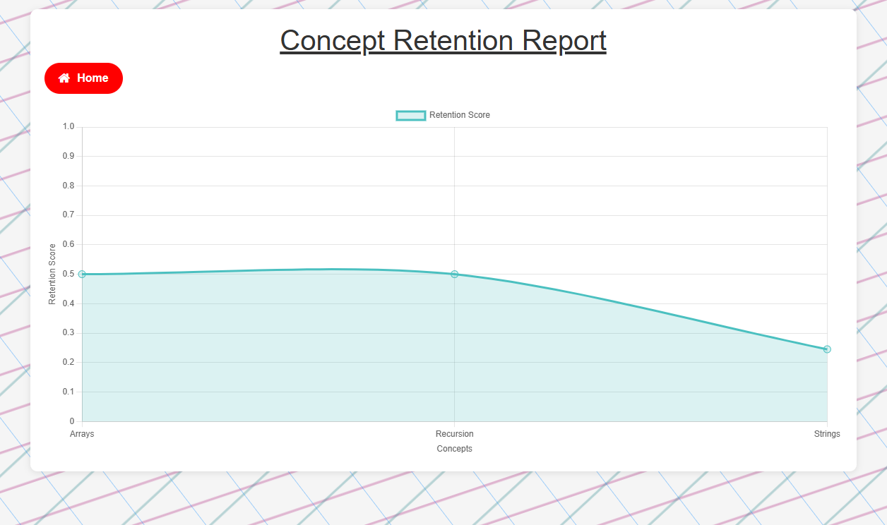
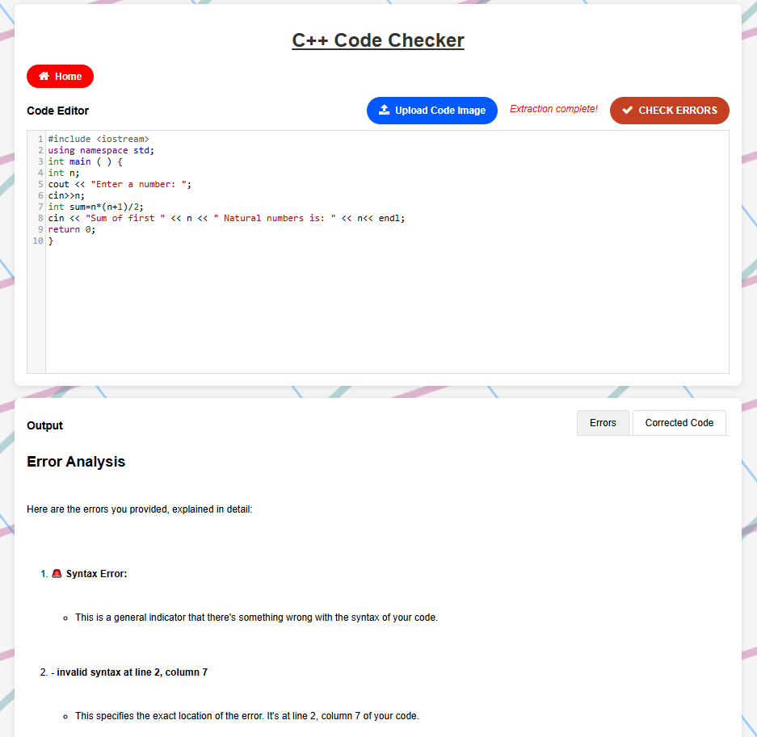
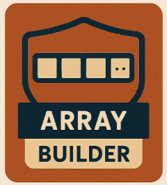
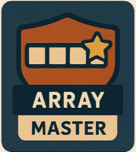
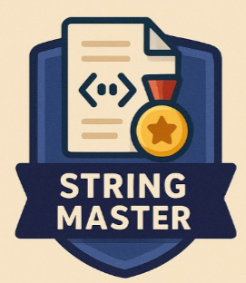
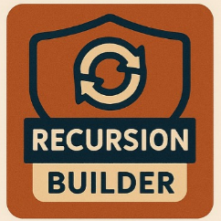
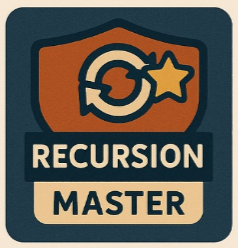

# 🧠 NeuroTutor

**NeuroTutor** is a Flask-based web application designed to help users enhance their debugging skills and understand Python code better through interactive challenges. The platform includes user authentication, code analysis, and automatic correction capabilities.

---

## 🚀 Features

* 🧾 User Authentication (Register/Login/Logout)
* 🛠️ Code Debugging Challenges
  * Python (/debugger-challenge)
  * C++ (/code-checker-cpp)
* 🧪 Error Detection and Symbolic Debugging
  * Python and C++ code support
* 📷 OCR Code Extraction from Image Uploads
* 🧠 Adaptive Forgetting Curve Quiz System
  * Reinforces retention over time
* 🔁 Daily Login Rewards
* 🔧 Automatic Code Correction
* 📊 User Progress Reports
  * Visual insights into concept mastery
* 🏅 Gamified Badge System
  * Earn badges for achievements across skills

---

## 🖥️ Tech Stack

- **Backend:** Python, Flask  
- **Frontend:** HTML, Jinja2 Templates  
- **Database:** MySQL (via `flask_mysqldb`)  
- **Security:** Password hashing with Werkzeug  
- **Image-to-Code:** `pytesseract`, `PIL`
- **Debugging Engine:** Custom modules (`groq_api_debug`, `symbolic_debugger`)

---

## 📂 Project Structure

```
.
├── app.py                   # Main Flask app
├── templates/               # HTML templates
│   ├── index.html
│   ├── login.html
│   ├── register.html
│   ├── my_badges.html
│   ├── code.html
│   ├── debug.html
│   ├── code_cpp.html
│   ├── forgetting.html
│   └── report.html
├── static/                  # CSS, JS, and images
│   ├── images/              # Badge icons
│   ├── bg.svg
│   ├── style.css
│   └── script.js
├── groq_api_debug.py        # Challenge generator & solution validator
├── symbolic_debugger.py     # Static code analysis engine
├── forgetting_graph.py      # Adaptive forgetting algorithm
├── LICENSE
├── README.md
├── neuro_tutor_db.sql       # Database schema for MySQL
```

---

## 🛠️ Setup Instructions
### 1. Clone the Repository
```
git clone https://github.com/Skanda-P-R/NeuroTutor.git
cd NeuroTutor
```
### 2. Install Dependencies
```
pip install -r requirements.txt
```
### 3. Set Environment Variables
First head to [Groq Console](https://console.groq.com/home), create an account, and get an ```API Key```.<br>
Next we will set up the environment variables.
For **Linux** users, type this in your terminal:
```
export sql_username=your_mysql_username
export sql_password=your_mysql_password
export groq_api=your_groq_api
```
For **Windows** users, follow the below steps:<br>
1. Press "Windows + R" buttons. This will open the ```Run``` application.
2. Type ```sysdm.cpl``` and click OK.
3. Select ```Advanced``` Tab and click on ```Environment Variables```.
4. In the ```User Variables``` tab, click on ```New```, and set the "Variable Name" as ```sql_username``` and "Variable Value" as ```your_mysql_username```.
5. Create two more variables for ```sql_password``` and ```groq_api```.
### 4. Configure MySQL
- Run the XAMPP Control Panel application, and Click on "Start" button for Apache and MySQL Module.
- Then Click on the "Admin" button for MySQL Module. A page with URL http://localhost/phpmyadmin/ will open, here follow the below steps:
  - Click on "Databases" in the top toolbar
  - In the "Create database" input section, type the "Database name" as ```neuro_tutor_db```, then click the "Create" button.
  - Then, the newly created database opens up. NOw in the top toolbar, select the "Import" button, then click on "Choose File", then navigate to this cloned repository, and select the ```neuro_tutor_db.sql``` file.
  - Then scroll all the way below, and Click on "Import" button. Now, all the tables would be successly imported.
### 5. Run the App
```
python app.py
```
Visit http://localhost:5000/ in your browser.

---

## ✅ API Endpoints

| Route                      | Method   | Description                                |
| -------------------------- | -------- | ------------------------------------------ |
| `/`                        | GET      | Home dashboard (requires login)            |
| `/login`                   | GET/POST | Login page                                 |
| `/register`                | GET/POST | User registration                          |
| `/logout`                  | GET      | Logout user                                |
| `/code-checker`            | GET      | Python code analysis interface             |
| `/code-checker-cpp`        | GET      | C++ code analysis interface                |
| `/debugger-challenge`      | GET      | Debug challenge interface (Python)         |
| `/my-badges`               | GET      | View earned badges                         |
| `/report`                  | GET      | Retention score report chart               |
| `/forgetting`              | GET      | Adaptive forgetting quiz                   |
| `/get_code`                | POST     | Generate debugging challenge code          |
| `/check_solution`          | POST     | Compare user's debug with expected fix     |
| `/check_errors`            | POST     | Analyze and correct Python code            |
| `/check_errors_cpp`        | POST     | Analyze and correct C++ code               |
| `/get_next_question`       | POST     | Get next quiz question (adaptive)          |
| `/submit_answer`           | POST     | Submit quiz answer, get score & reward     |
| `/get_attempted_questions` | POST     | Fetch all past attempted questions by user |
| `/extract-code`            | POST     | OCR to extract code from uploaded image    |

---

## 🏅 Badge System
Badges are awarded based on:
* Daily login streaks
* Number of questions debugged
* Number of codes corrected
* Retention score per concept

Badge progress is stored in `user_badges` and automatically updated.

--- 

## 🙌 Contribution
Feel free to fork this repo and submit pull requests. For major changes, open an issue first to discuss your idea.

---

## 📃 License
This project is licensed under the MIT License. See the [LICENSE](https://github.com/Skanda-P-R/NeuroTutor/blob/main/LICENSE) file for details.

---
## 🌐 Website Preview

<details>
<summary>🔐 Login Page</summary>
<p align="center"></p>
</details>

<details>
<summary>📝 Register Page</summary>
<p align="center"></p>
</details>

<details>
<summary>🧰 Tool Selection</summary>
<p align="center"></p>
</details>

<details>
<summary>🧠 Code Solver (Forgetting Graph)</summary>
<p align="center"></p>
<p align="center"></p>
</details>

<details>
<summary>🧪 Code Error Checking and Correcting</summary>
<p align="center"></p>
<p align="center"></p>
</details>

<details>
<summary>🐞 Code Debugging</summary>
<p align="center"></p>
</details>

<details>
<summary>🏅 Badge Popup</summary>
<p align="center"></p>
</details>

<details>
<summary>🎖️ Viewing the Earned Badges</summary>
<p align="center"></p>
</details>

<details>
<summary>📜 Badges Description</summary>
<p align="center"></p>
</details>

<details>
<summary>🏅 View all Badges</summary>
<p align="center">
  
  
  
  
  
  
  
  
  
  
  
  
  
  
  
  
  
</p>
</details>