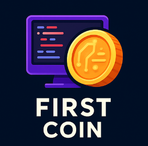
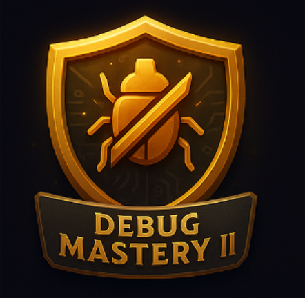
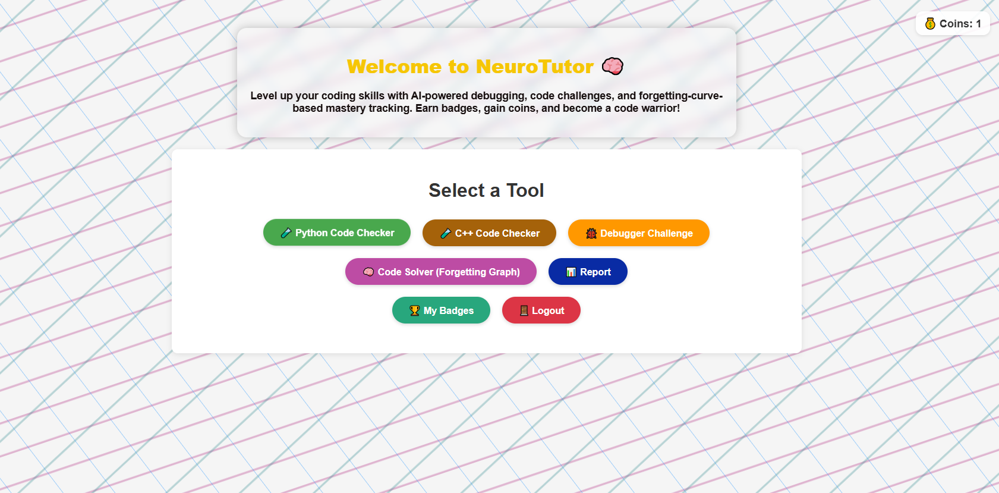
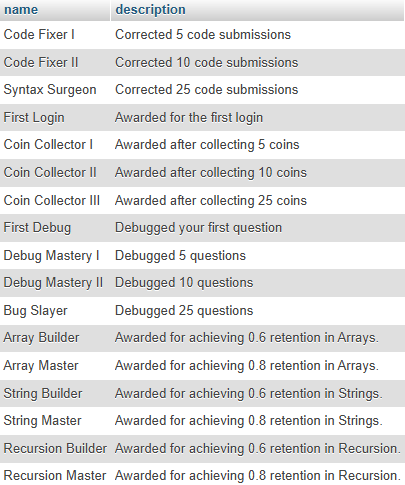

# 🧠 NeuroTutor

**NeuroTutor** is a Flask-based web application designed to help users enhance their debugging skills and understand Python code better through interactive challenges. The platform includes user authentication, code analysis, and automatic correction capabilities.

---

## 🚀 Features

- 🧾 **User Authentication** (Register/Login/Logout)
- 🛠️ **Code Debugging Challenges**
- 🧪 **Code Error Detection**
- 🔧 **Automatic Code Correction**
- 📊 **Progress Tracking** (questions debugged & codes corrected)
- 🏅 **Badge System** (Generates badges to users based on tasks completed)

---

## 🖥️ Tech Stack

- **Backend:** Python, Flask  
- **Frontend:** HTML, Jinja2 Templates  
- **Database:** MySQL (via `flask_mysqldb`)  
- **Security:** Password hashing with Werkzeug  
- **Debugging Engine:** Custom modules (`groq_api_debug`, `symbolic_debugger`)

---

## 📂 Project Structure

```
.
├── app.py                   # Main Flask app
├── templates/               # HTML templates
│   ├── index.html
│   ├── login.html
│   ├── register.html
│   ├── my_badges.html
│   ├── code.html
│   └── debug.html
├── static/                  # All the CSS and JS codes
│   ├── images/              # Contains all the images of Badges
│   ├── bg.svg
│   ├── style.css
│   └── script.js
├── groq_api_debug.py        # Challenge code generator & comparison logic
├── symbolic_debugger.py     # Code analysis and correction
├── LICENSE
├── README.md
```

---

## 🛠️ Setup Instructions
### 1. Clone the Repository
```
git clone https://github.com/Skanda-P-R/NeuroTutor.git
cd NeuroTutor
```
### 2. Install Dependencies
```
pip install -r requirements.txt
```
### 3. Set Environment Variables
First head to [Groq Console](https://console.groq.com/home), create an account, and get an ```API Key```.<br>
Next we will set up the environment variables.
For **Linux** users, type this in your terminal:
```
export sql_username=your_mysql_username
export sql_password=your_mysql_password
export groq_api=your_groq_api
```
For **Windows** users, follow the below steps:<br>
1. Press "Windows + R" buttons. This will open the ```Run``` application.
2. Type ```sysdm.cpl``` and click OK.
3. Select ```Advanced``` Tab and click on ```Environment Variables```.
4. In the ```User Variables``` tab, click on ```New```, and set the "Variable Name" as ```sql_username``` and "Variable Value" as ```your_mysql_username```.
5. Create two more variables for ```sql_password``` and ```groq_api```.
### 4. Configure MySQL
- Run the XAMPP Control Panel application, and Click on "Start" button for Apache and MySQL Module.
- Then Click on the "Admin" button for MySQL Module. A page with URL http://localhost/phpmyadmin/ will open, here follow the below steps:
  - Click on "Databases" in the top toolbar
  - In the "Create database" input section, type the "Database name" as ```neuro_tutor_db```, then click the "Create" button.
  - Then, the newly created database opens up. NOw in the top toolbar, select the "Import" button, then click on "Choose File", then navigate to this cloned repository, and select the ```neuro_tutor_db.sql``` file.
  - Then scroll all the way below, and Click on "Import" button. Now, all the tables would be successly imported.
### 5. Run the App
```
python app.py
```
Visit http://localhost:5000/ in your browser.

---

## ✅ API Endpoints

| Route                  | Method    | Description                          |
|------------------------|-----------|--------------------------------------|
| `/`                    | GET       | Home page (protected)                |
| `/login`               | GET/POST  | User login                           |
| `/register`            | GET/POST  | User registration                    |
| `/logout`              | GET       | Logout and clear session             |
| `/code-checker`        | GET       | Code checker interface               |
| `/debugger-challenge`  | GET       | Debugging challenge interface        |
| `/get_code`            | POST      | Get code based on difficulty         |
| `/check_solution`      | POST      | Submit and verify debugging solution |
| `/check_errors`        | POST      | Analyze code for errors              |
| `/correct_code`        | POST      | Get AI-corrected version of the code |
| `/my-badges`           | POST      | Get the list of earned badges of user|

--- 

## 🙌 Contribution
Feel free to fork this repo and submit pull requests. For major changes, open an issue first to discuss your idea.

---

## 📃 License
This project is licensed under the MIT License. See the [LICENSE](https://github.com/Skanda-P-R/NeuroTutor/blob/main/LICENSE) file for details.

---

## 🖼️ Badge Gallery

<p align="center">
  
  
  
  
  
  
  
  
  
  
  
</p>

---
## 🌐 Website Preview

<details>
<summary>🔐 Login Page</summary>
<p align="center"></p>
</details>

<details>
<summary>📝 Register Page</summary>
<p align="center"></p>
</details>

<details>
<summary>🧰 Tool Selection</summary>
<p align="center"></p>
</details>

<details>
<summary>🧠 Code Error Checking and Correcting</summary>
<p align="center"></p>
</details>

<details>
<summary>🐞 Code Debugging</summary>
<p align="center"></p>
</details>

<details>
<summary>🏅 Badge Popup</summary>
<p align="center"></p>
</details>

<details>
<summary>🎖️ Viewing the Earned Badges</summary>
<p align="center"></p>
</details>

<details>
<summary>📜 Badges Description</summary>
<p align="center"></p>
</details>
